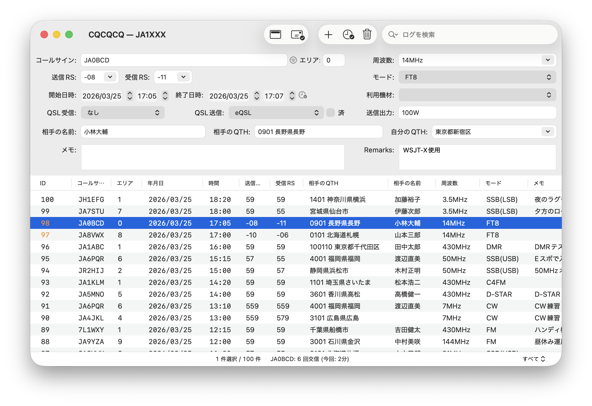

# CQCQCQ

アマチュア無線の交信記録（QSO）を管理するためのピュアネイティブアプリです。Mac / iPhone / iPad / Apple Watch に対応。サードパーティライブラリやクロスプラットフォームフレームワークを一切使用せず、Apple純正フレームワーク（SwiftUI, SwiftData, AppKit, CoreLocation）のみで構築されています。

A pure native QSO logging app for amateur radio operators. Supports Mac, iPhone, iPad, and Apple Watch. Built entirely with Apple-native frameworks (SwiftUI, SwiftData, AppKit, CoreLocation) — no third-party libraries or cross-platform frameworks.



---

## Features / 機能

### QSO Logging / 交信記録

コールサイン、RS、周波数、モード、使用機材、送信出力など20以上のフィールドに対応。開始・終了時刻の記録もできます。

Log contacts with 20+ fields including callsign, RS reports, frequency, mode, equipment, TX power, and start/end timestamps.

| Mac | iPad |
|-----|------|
|  |  |

### QSL Card Tracking / QSLカード管理

QSLカードの送受信状況を管理。JARL、eQSL、ダイレクトなど送信方法ごとに追跡できます。未完了のQSLだけをフィルタリングする機能も。

Track QSL card exchange status per contact. Filter by incomplete QSL to see what's pending.


### JCC/JCG Dictionary / JCC/JCG辞書

JARLのJCC（日本の市）・JCG（郡）コードを内蔵辞書で検索。都道府県ごとの絞り込み、コードのワンクリックコピーに対応。Qコード、モールス符号（欧文・和文）、フォネティックコードの辞書も搭載。

Built-in JCC/JCG code dictionary with prefecture filtering and one-click copy. Also includes Q codes, Morse code (Western & Japanese Wabun), and NATO phonetic alphabet references.


### Morse Converter / モールス変換

テキストをモールス符号に変換・再生できるユーティリティ。欧文・和文モールスに対応し、WPM速度調整、再生中のカラオケ風ハイライト表示、クリップボードコピーが可能。macOSではユーティリティウィンドウ（⌘⇧M）、iOS/iPadでは設定画面から利用可能。

Convert text to Morse code with audio playback. Supports both Western and Japanese (Wabun) Morse. Features WPM speed control, karaoke-style character highlighting during playback, and clipboard copy. Available as a utility window on macOS (⌘⇧M) and from Settings on iOS/iPad.

### Band Plan / バンドプラン

日本のアマチュアバンドプランを内蔵表示。周波数帯ごとの使用区分を一覧で確認できます。macOSではユーティリティウィンドウ（⌘⇧B）として利用可能。

Built-in Japanese amateur band plan viewer. Quickly check frequency allocations by band. Available as a utility window on macOS (⌘⇧B).

### ADIF Import & Export / ADIF入出力

ADIF（Amateur Data Interchange Format）形式のインポート・エクスポートに対応。他のロギングソフトとのデータ交換が可能です。

Import and export QSO data in ADIF format for interoperability with other logging software.

### CSV Import & Export / CSV入出力

QSOデータのCSVエクスポート・インポートに対応。HAMLOG形式のCSV取り込みにも対応しています。

Export and import QSO data as CSV. Supports HAMLOG CSV format import.

### QSO Detail Window / QSO詳細ウィンドウ

macOSではQSOの詳細を別ウィンドウで開くことができます。リストの文字サイズは⌘+/⌘-/⌘0で拡大・縮小・リセットが可能。周波数入力はコンボボックス方式で、登録済み周波数の選択と自由入力の両方に対応。

On macOS, open QSO details in a separate window. Adjust list font size with ⌘+/⌘-/⌘0. Frequency input uses a combo box supporting both registered presets and free-form entry.

### Search & Filter / 検索・フィルタ

Macではコールサイン、名前、QTH、周波数など複数フィールドの横断検索に対応。検索フィールドはツールバーに統合され、クリックで展開・Escで収縮するFinder風のインターフェース。スコープ切り替えやオートコンプリートにも対応。iOS/iPadでは機材・周波数・モード・期間・QSL状態でのフィルタリングが可能。

Full-text search across multiple fields on Mac with a Finder-style collapsible search field in the toolbar. Supports scope switching and autocomplete suggestions. Advanced filtering by equipment, frequency, mode, date range, and QSL status on iOS/iPad.

### Settings / 設定

周波数帯、モード、使用機材、QTH、QSL送信方法、自局コールサイン・名前をカスタマイズ。表示項目の切り替えにも対応。

Customize visible frequencies, modes, equipment list, QTH locations, QSL methods, and your own station callsign/name.


---

## Platform Support / 対応プラットフォーム

| Platform | Features |
|----------|----------|
| **macOS** | NSToolbarによるカスタマイズ可能なツールバー、Finder風収縮検索フィールド、期間フィルタ・年月日検索、カラム並べ替え、辞書・モールス・バンドプランのユーティリティウィンドウ、QSO詳細ウィンドウ、文字サイズ変更（⌘+/-/0）、周波数コンボボックス、ステータスバー、キーボードショートカット |
| **iPad** | スプリットビュー、GPS連携、フィルタシート、PencilKit手書きメモパッド |
| **iPhone** | コンパクトなリスト表示、GPS連携、フィルタシート |
| **Apple Watch** | QSOログ一覧・詳細表示、新規QSO入力、スワイプ削除 |

---

## Tech Stack / 技術スタック

- **SwiftUI + AppKit** - SwiftUIベースにmacOSではAppKit（NSToolbar, NSViewRepresentable）を活用したハイブリッド構成
- **SwiftData** - データ永続化
- **CoreLocation** - GPS位置情報（iOS/iPad）
- **AVFoundation** - モールス符号トーン生成・再生
- **PencilKit** - 手書きメモパッド（iPad）
- **WatchKit** - Apple Watch対応

---

## Requirements / 動作環境

- macOS 15.0+
- iOS 18.0+ / iPadOS 18.0+
- watchOS 11.0+
- Xcode 16.0+

---

## Build / ビルド

```bash
git clone https://github.com/nobtaka/CQCQCQ.git
cd CQCQCQ
open CQCQCQ.xcodeproj
```

Xcodeでスキームを選択してビルド・実行してください。

Open in Xcode, select your target platform, and build.

---

## Screenshots / スクリーンショット

> スクリーンショットは `screenshots/` ディレクトリに追加してください。
>
> Place your screenshots in the `screenshots/` directory:
>
> - `main-window.png` - メインウィンドウ全体
> - `mac-form.png` - Mac版フォーム
> - `ipad-view.png` - iPad版画面
> - `qsl-filter.png` - QSLフィルタ
> - `dictionary.png` - 辞書ウィンドウ
> - `settings.png` - 設定画面

---

## Changelog / 開発ログ

開発の経緯と変更履歴は [CHANGELOG.md](CHANGELOG.md) を参照してください。

See [CHANGELOG.md](CHANGELOG.md) for the development history and changes.

---

## Roadmap / ロードマップ

今後の開発予定は [ROADMAP.md](ROADMAP.md) を参照してください。

See [ROADMAP.md](ROADMAP.md) for planned features and development roadmap.

---

## Developer / 開発者

CQCQCQ は [@NobtakaJP](https://x.com/NobtakaJP) が設計・開発・デザインまですべて1人で手がけている個人プロジェクトです。

CQCQCQ is a solo project — designed, developed, and maintained entirely by [@NobtakaJP](https://x.com/NobtakaJP).

- **X (App)**: [@CQCQCQApp](https://x.com/CQCQCQApp)
- **X (Developer)**: [@NobtakaJP](https://x.com/NobtakaJP)
- **Feedback / フィードバック**: [GitHub Issues](https://github.com/nobtaka/CQCQCQ-web/issues)

---

## License / ライセンス

Private project.

---

**73 de the developer!**
